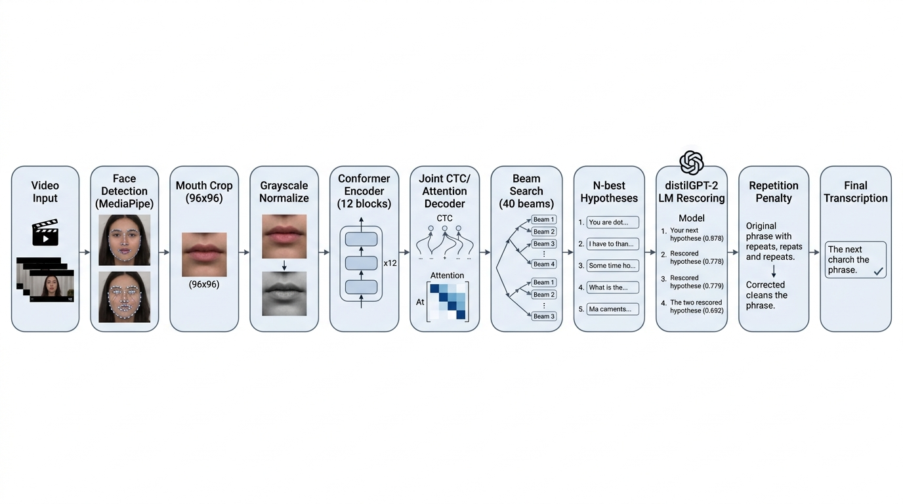
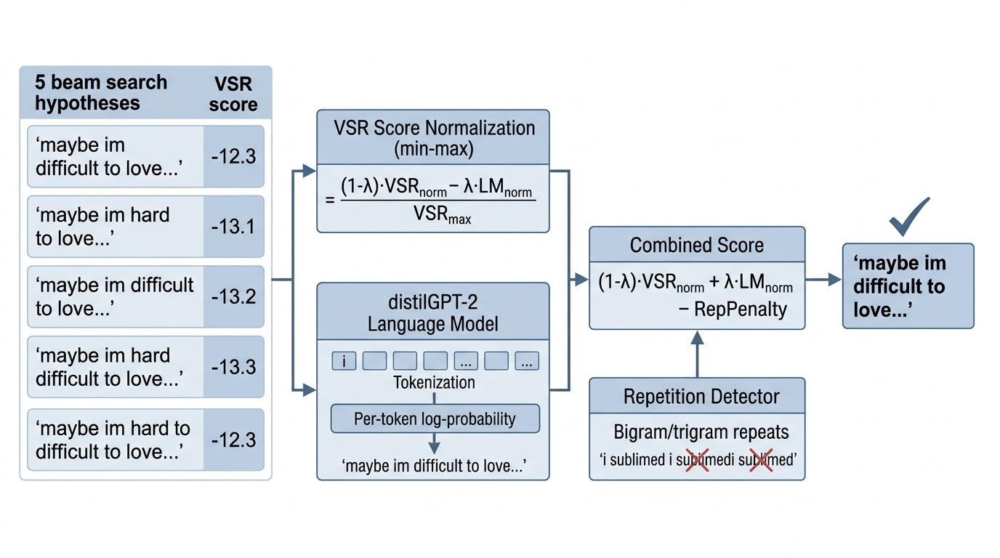

Визуальное распознавание речи для соревнования OmniSub 2026

Автор: Кива Данила
Дата: 19 марта 2026
Репозиторий: https://github.com/noshackleshot/omni-sub
Итоговый результат: 0.539 WER на финальном тесте, 4-е место из 11 команд.

Решение

На первом этапе я заметил, что тестовые клипы имеют те же идентификаторы, что и данные LRS2-BBC. Это позволяло сопоставлять ответы по ключам, не решая задачу распознавания напрямую. Я построил трёхуровневую систему матчинга: прямое совпадение ключей, поиск по каналу с ранжированием через CTC/attention-скоринг и fuzzy matching, и глобальный поиск с фильтрацией по длине и триграммам.

18 марта тест заменили на 49 клипов разговорной речи, все предыдущие результаты обнулились. Я перешёл к чистому VSR, взяв предобученную модель auto_avsr (https://github.com/mpc001/auto_avsr) — Conformer encoder (12 блоков, 768 dim), Transformer decoder (6 блоков), совместное CTC+Attention декодирование.

Пайплайн: MediaPipe извлекает 468 лицевых ландмарков, из них вырезается область рта 96x96 в grayscale, Conformer кодирует визуальные фичи, beam search с beam_size=40 генерирует до 40 гипотез на клип.

Рис. 1. Архитектура VSR-пайплайна

Первый прогон базовой модели дал 0.543 WER. Модель справлялась с простыми фразами, но на разговорной речи появлялись повторения, галлюцинации и ошибки контекста.

LM rescoring

Ключевой идеей стал post-hoc LM rescoring. Вместо того чтобы менять саму VSR-модель, я добавил второй этап: языковая модель distilgpt2 (82M параметров) оценивает каждую из 40 гипотез по лингвистической вероятности. Комбинированный скор:

score = (1 − λ) · VSR_norm + λ · LM_norm − rep_penalty

где λ = 0.3, а repetition penalty штрафует повторяющиеся биграммы, триграммы и последовательные повторы чанков.

Рис. 2. Схема переранжирования гипотез

Все гипотезы и скоры сохранялись в JSON, что позволяло подбирать lm_weight и rep_penalty офлайн, без GPU. Инференс прогонялся один раз на арендованной RTX 3090.

Base model + LM rescoring с lm_weight=0.3 и rep_penalty=2.0 дал 0.539 WER. LM rescoring стабильно делал фразы более естественными, а repetition penalty убирал зацикливание.

Что не сработало

Я также пробовал large модель auto_avsr (~250M параметров, 19.1% WER на LRS3). Она исправляла некоторые ошибки базовой, но вносила новые, например хуже распознавала топонимы. При двух попытках в день подавать её результат было слишком рискованно.

Параллельно я начал файнтюнить large модель на тренировочных данных (attention-only loss, frozen frontend, lr = 3×10⁻⁵, 2 эпохи). Метрики на обучении выглядели отлично: loss упал со 110 до 3.6, accuracy выросла до 94.5%. Но затем тест сменился на casual speech, и дообученная модель оказалась в ловушке — она заточилась под формальную BBC-речь, а на разговорной выдавала «unk» почти на всё. Файнтюнинг на данных из одного домена перезаписал способность модели работать с другим.

Итоговые результаты

На финальном тесте базовая модель без постобработки показала 0.543 WER. Base model + LM rescoring улучшил результат до 0.539 WER — это и стало финальной подачей. Файнтюн large модели дал WER выше 1.0 из-за коллапса.

Выводы

Главная проблема — domain shift. Модель, обученная на BBC, заметно деградирует на разговорной речи, и это не было видно на отладочном тесте из того же домена. Значительная часть времени ушла на оптимизацию пайплайна для отладочного теста, который был аннулирован, а на поиск лучшей архитектуры времени уже не осталось.

Post-hoc LM rescoring оказался дешёвым и рабочим инструментом: distilgpt2 скорирует тысячи гипотез за секунду, не требует переобучения и позволяет подбирать веса без GPU.

Если бы я начинал заново, я бы сразу взял модель с более широким покрытием доменов (AV-HuBERT или VSP-LLM), попробовал self-training на неразмеченных данных и потратил меньше времени на scoring weights.

---

Ma, P. et al. «Auto-AVSR: Audio-Visual Speech Recognition with Automatic Labels.» ICASSP 2023. Репозиторий: https://github.com/mpc001/auto_avsr. Решение: https://github.com/noshackleshot/omni-sub.
